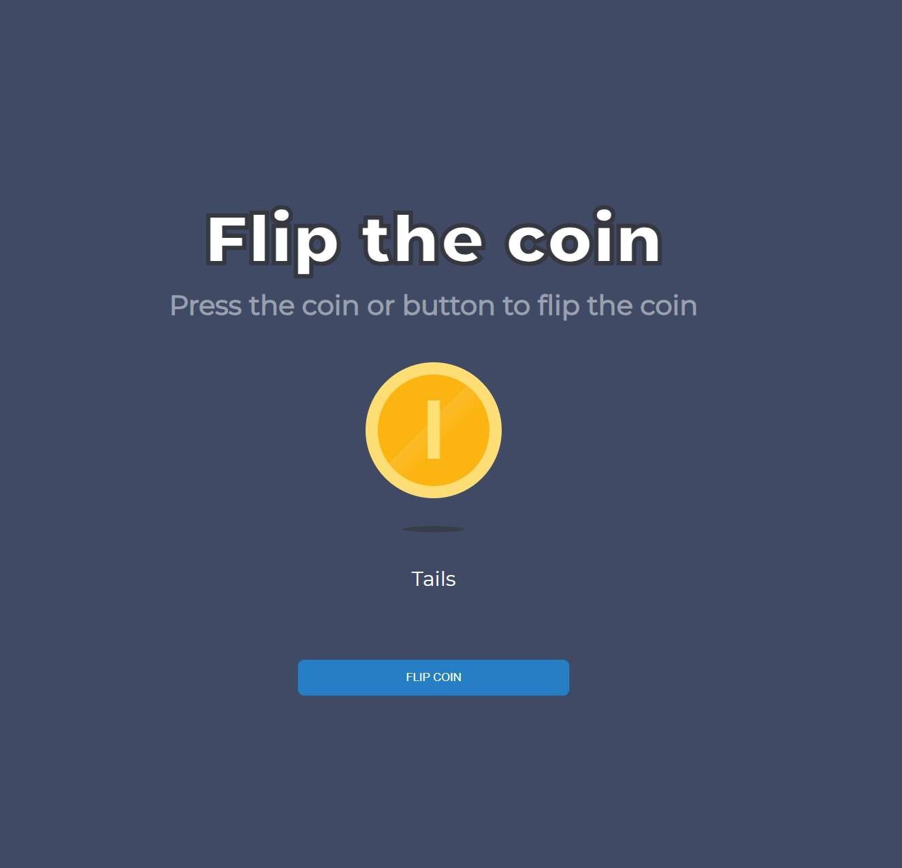

# Flip The Coin

A small Vue 3 + TypeScript app that flips a coin with animation and displays the result.

## Screenshot

## Features

- Flip the coin by clicking the coin or the `FLIP COIN` button.
- Prevents spam clicks while a flip animation is running.
- Uses a fixed `700ms` flip duration.
- Respects reduced motion preference by skipping animation and showing the result immediately.
- Announces result changes with `aria-live="polite"` for screen readers.
- Responsive layout for desktop and mobile viewports.

## Tech Stack

- Vue 3
- Vite
- TypeScript
- Vitest (`jsdom`)

## Scripts

- `npm run dev`: Start local development server.
- `npm run build`: Type-check and build production assets.
- `npm run preview`: Preview the production build locally.
- `npm run test`: Run unit tests.
